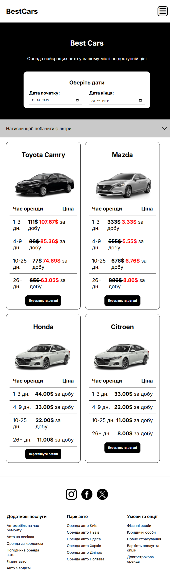
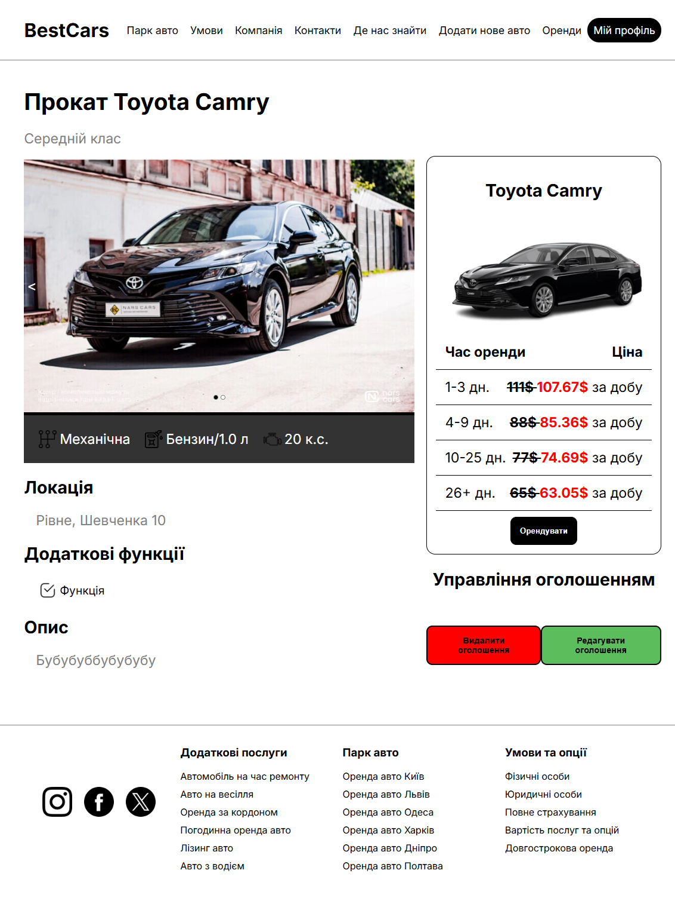
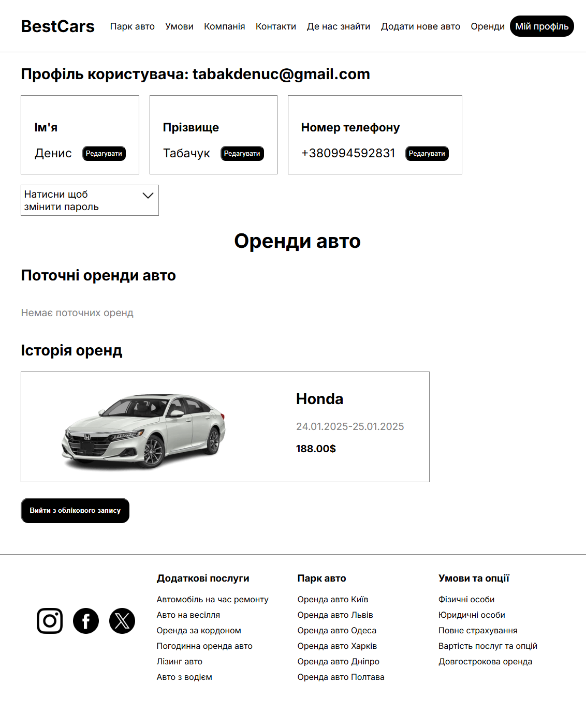
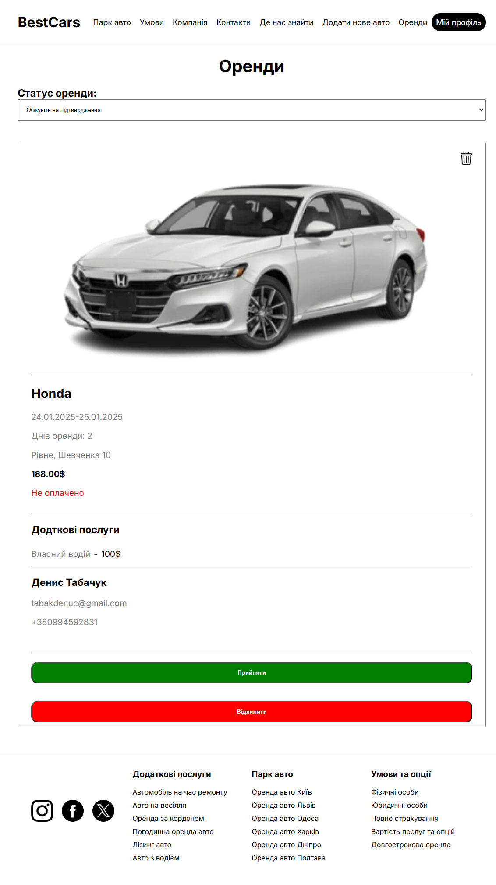
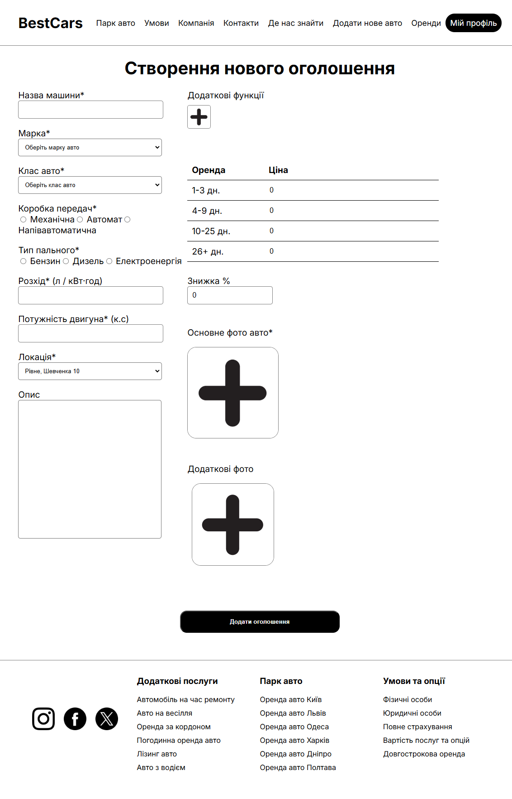
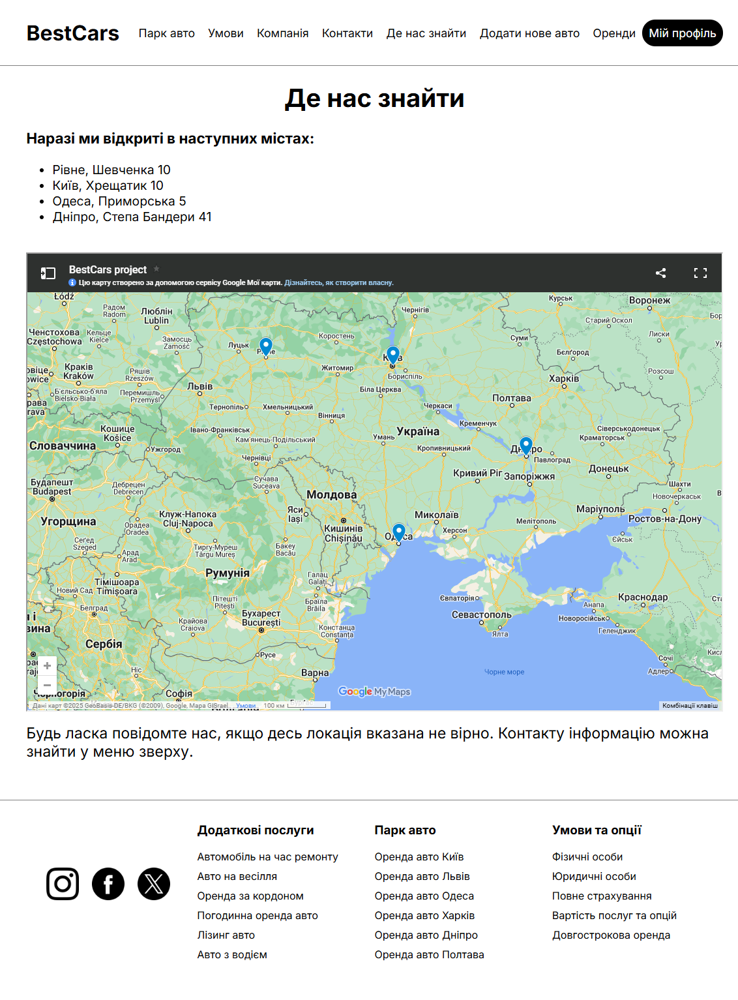

# Coursework for the 3rd Year of KPI, FICT, 121 Software Engineering

This project is a **modern web application** that serves as a **car rental and dealership platform**, built using the **Python Django framework** for the backend and **React.js** for the frontend. It combines a robust server-side architecture with a dynamic, user-friendly client interface to provide seamless user experiences.

This platform has three types of users, each with different access levels and permissions:

### 1. **Unauthorized User**
An unauthorized user can:
- View company information, rental terms, and car details.
- Access the registration and login pages.
- Use basic car search functionality with filters.

### 2. **Authorized User**
An authorized user can:
- Rent a car.
- View and edit their personal profile.
- View current and past rentals.

### 3. **Administrator**
An administrator has full control over the platform and can:
- Manage car rentals (view and update rental status).
- Manage the car fleet (add, edit, and delete cars).


I know there's a lot of room for improvement and rework, but I made it to the deadline! 😊

---


# Project Setup Guide

## **Setup Instructions**

### **Cloning the Project**
1. Open your terminal or command line and clone the repository:
    ```bash
    git clone https://github.com/DenysTabachuk/react_django_project
3. Navigate to the project directory:
   ```bash
   cd react_django_project
### Frontend Setup
1. Ensure Node.js is installed in your environment
   ```bash
   node -v
3. Verify npm is installed:
   ```bash
   npm -v
5. If Node.js or npm is not installed, download and install them from the official website.
6. Navigate to the React frontend directory:
   ```bash
   cd best_cars_react
8. Install the required dependencies:
   ```bash
   npm install

### Backend Setup
1. Ensure Python is installed in your environment:
   ```bash
   python --version
2. If Python is not installed, download and install it from the official website.
3. Navigate to the Django backend directory:
     ```bash
     cd best_cars_django
4. Install the required dependencies:
    ```bash
    pip install -r requirements.txt

## Running the Application
1. Start the Django backend server:
   ```bash
   python manage.py runserver
3. Start the React development server:
   ```bash
   npm start
5. Open your browser and navigate to:
   - Frontend: http://localhost:3000
   - Backend: http://127.0.0.1:8000


# Screenshots of the Platform

Here are some screenshots showcasing different pages of the car rental and dealership platform:

### 1. **Home Page**

The landing page of the platform where users can see available cars and start the rental process.

### 2. **Car Info Page**

Detailed information about a selected car.

### 3. **Profile Page**

The user's personal profile page where they can view and edit their information.

### 4. **Rentals Confirmation**

A confirmation page, where admin can confirm or reject rental requests.

### 5. **Add New Car Page**

Page for the admin to add new cars to the platform, including car details and photos.

### 6. **Locations Page**

A map displaying the locations of dealerships.


